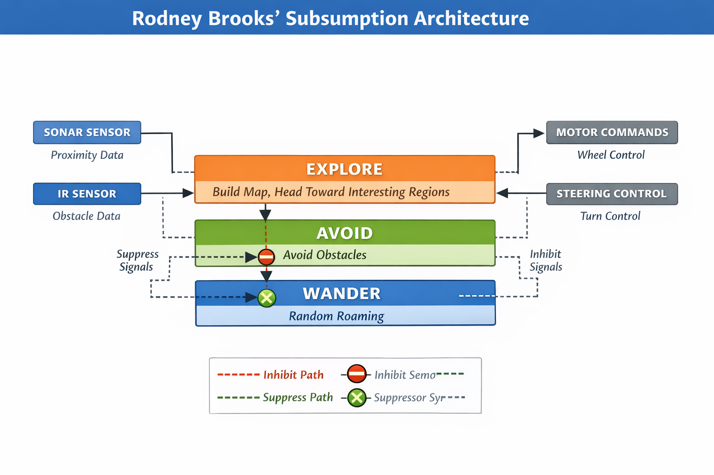
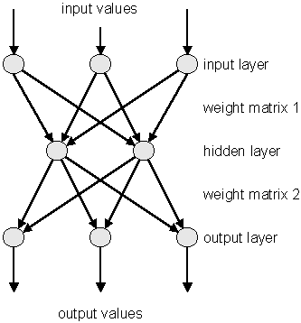
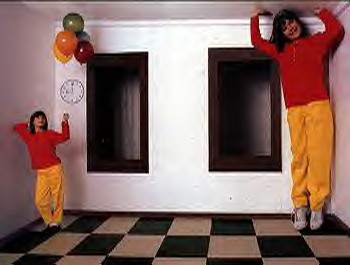
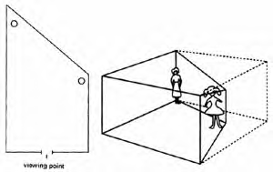

# Presentation: Perception Lecture 3.pptx

## Slide 1

Summary of conventional computational representational approach to perception.

Starting assumption: Poverty of the stimulus.

Entails representation (cognitive mediation of perception). Sensory data must be ‘processed’ (i.e., modified, interpreted) to reflect actual state of affairs of world (presumably by virtue of inference).

Cognitive mediation  Primacy of cognition in perceptual theory.

Computational view: Richness/generativity/productivity of perception suggests that perception/cognition must be language-like (finite predicates, finite rules, indefinite variety) … the language of thought.

Perception, like language, can be understood as a formal system.

Computation embodies our understanding of a formal system (i.e., symbol manipulation according to rules) and offers the kind of features a representational perceptual system require.

Presumably knowledge for inferences is innate (because formal computational systems have all of their computational power from the start).

---

## Slide 2

Counterpoints to traditional computational representational approach  from within information processing theoretical framework:

Criticism of Logicism (i.e., formal language of thought):  emphasis on conceptual structure (i.e., the concepts an intelligent being must have).

Ignore context.

Assigning/endowing of a system (e.g., a pattern recognition device) with concepts is done by the creator of the system (e.g., person building the AI device).

Assumes we know the “right” predicates.

Rodney Brooks: one cannot come to terms with central representation without knowing instruments that register the world and machinery that acts upon it (i.e., must ground a system to its world to understand it).  Can’t guess at concepts. Must incrementally build smart, special-purpose devices.

---

## Slide 3

Physical Grounding Hypothesis: ground activity of intelligent system in physical world.  Deals immediately with linking the system to the world … but without concepts. Can make predictions/plans/have goals without symbolic representations

Building intelligence without concepts: Substitute behavioral function modules for generic info-processing modules.  Build special purpose devices that are simultaneously perception-action devices.

Each activity-producing layer connects input to output

No partitioning of perception & action

No knowledge of internal workings of each other (encapsulated modules).

No central representation/control

---

## Slide 4

Brooks is avoiding requirements of productivity at THIS level.

“Elephants don’t play chess”. Don’t start with chess. Take many of these special-purpose devices and increment them, might see productivity.  Subsume “skills” into a bigger system and create intelligent Creatures (i.e., intelligence emerges from collection of abilities to solve specific problems).

No central representation … no central anything.  No place where you can see percepts or concepts explicitly.

---

## Slide 5

Modern neural network theory (not a symbol manipulating process)

Massively parallel system inspired by brain. Brain has order of 1014 connections.

All parts behaving at long time scales (Neurons very slow compared to computers)… Speed comes from parallelism.

Digital Computation (sequential): ↑ constraints (rules) to make guess of what caused input. Explicit rules → explicit symbols.

Extensive sequential steps. Only way to speed up is to make processor better.

Connectionism: Embed constraints as weighted connections among many components.  Weights determined by experience.

Weighted connections embody statistical regularity of experience (in a distributed fashion) … sub-symbolic. No explicit constraints (i.e., no declarative knowledge), just massive parallel activity (don’t need components to be terribly fast).

Learning takes place via a single rule:

Hebb’s rule: if two things are contiguously active, strengthen activations.

---

## Slide 6

One final challenge for (formal) computational representational theory (from within):

Searle:  An attack on the formality condition (that mind is essentially a formal computational device: Turing Reduction → mental states are the computational states of a Turing Machine).

Searle: Intentionality (about-ness/meaning of mental states) appears to be a characteristic feature of carbon-based feature.

---

## Slide 7

The Ecological approach

(James Gibson)

Attempting to assert (in a scientifically sound way) direct realism.

Direct realism: what you see is what is there (no epistemic mediation).

Once theory uses in-between stuff, no way to guarantee that perception is of the world.

What is required for realism?  What are the conceptual barriers to realism?

---

## Slide 8

BARRIERS TO REALISM (conceptual challenges for  realism):

First Barrier

Animal-Environment Dualism –Organism separate from world, so has to figure it out.  Start out with a logical independence of the two (living and non-living).

Mental-ese

Physical-ese

Can’t use language of one to describe the other

… sciences of each proceed independently

Counterargument:

Animal Environment Mutuality: Animal and Environment are logically interdependent.

There is a fit between A and E … A & E co-evolved.

If there is AE mutuality/synergy (fitting together), science must build mutually compatible theories (of physics, environment, biology, energy distributions).  Otherwise, we are left with physical-ese and mental-ese.

Consider that once evolution of earth starts, things move very rapidly.  Becomes very hard to discuss earth without discussing life.

---

## Slide 9

Evolution does not distinguish organism and environment

I.  Earth-Life coevolution and Population One hypothesis

More complexly organized organisms dissipate more chemical energy at a faster rate

A Physical Evolutionary Principle (?):

Select for maximizing rate of entropy production

---

## Slide 10

Why does order increase in nature?

Increases the rate of producing disorder

One contentious view of these data:

There is an inseparability of living things and their surroundings.  The kind of logical independence we’ve assumed may not be quite correct.

Both living things and surroundings are part of a directed single planetary process of evolution … the planet is what evolved.

Direction of evolution characterized by an opportunistic strategy that produces entropy at the greatest rate.

Things to ponder about AE Mutuality:

More proper to think of earth as a population of one.  Not Darwinian evolution (i.e., replicating competing systems).

Planetary evolution cannot be addresses by Darwinian principles. Need something broader.

---

## Slide 11

Evolution does not distinguish organism and environment:

II. Probabilistic Epigenesis (Self-organizing Developmental Systems)

“Selection acts not only on the developmental outcome but also on the entire developmental process leading up to that outcome…including the context or contexts in which development takes place and those in which the outcomes are expressed (Miller, 1997, p. 495).”

---

## Slide 12

Second Barrier to Realism:

Doctrine of Intractable Non-specificity

Energy patterns to senses are necessarily non-specific to facts of world.

If true, cannot have realism. Every time something is perceived properly, must attribute to special brain capabilities.

Type of question driven by DOINS: How does ‘brain’ compensate for lack of specificity?

---

## Slide 13

Second Barrier to Realism:

Ecological counterargument:

Doctrine of Necessary Specificity: Patterned energy distributions are specific to facts of the world.

Don’t see specificity? Find better tools. Math and physics must be improved or discovered if you haven’t found them. More on this later (ecological optics)

Type of question driven by DONS: How do I reveal specificity (hint: need transformation in space & time)?

Notice how the different theoretical positions tell science how to proceed differently

---

## Slide 14

Third Barrier to Realism:

Doctrine of the Independence of Perception from Stimulation

Illusions: There are many conditions of stimulation for which my perception appears to be independent (i.e., Perception is different that actual state of affairs).

---

## Slide 15

Third Barrier to Realism:

Alternative:

Doctrine of the Specificity of Perception to “Information” (not stimulation).

There are NO illusions. Perception is lawfully specific (i.e., bears a 1:1 relationship) to information.

See illusion? Gibson: Probably measuring something improperly.

Do illusions tell us about inference failure or about current inadequacies of tools of science?

Illusions built on assumption that we are measuring the world properly. Is our math and physics suited to the problem?

Barriers DOINS and DOIPS promote representation to top of agenda.

DONS and DOSPI promote specificity to top of agenda.

---

## Slide 16

Fourth Barrier:

Doctrine of the Incommensurability of Natural Kinds

We describe world in a language that is different than we use to describe mental states (i.e., Behavioral E. vs. geographic E contrast)

Mental-ese

Physical-ese

---

## Slide 17

Fourth Barrier:

Alternative:

Doctrine of the Commensurability of Natural Kinds

There is a single language for the content of animal mind and environments (i.e., a single language for ecological systems).

Elton (ecologist): introduced concept of niche (vs. habitat).

A particular geographic location is the habitat of many species. Habitats identical, but niches are distinct.  Niche: functional definition of the environment.

Gibson’s approach: if you can describe the content of mind, you would already find content of the world (& vice versa).  No opacity … transparency … single language.

DOINK: mental-ese and physical-ese.

DOCNK: ecological-ese.

---

## Slide 18

Fifth barrier:

Doctrine of Perception as Proposition Making

Impose hypotheses on data to accommodate data.  Perceptual state is the proposition (e.g., “that is a door”)

I believe that’s a door

Perception as judgment permits the possibility of error.

Propositions can be true or false. If perception is a formal propositional process, then perception is not reliable (it can be either true or false). If perception is not incorrigible you cannot have realism.

---

## Slide 19

Fifth barrier:

Alternative:

Perception is a physical state of affairs (i.e., an ecological fact)

Gibson: Cannot ask if perception is right or wrong … perception simply IS. Perception is incorrigible. (e.g., Arrangement of this room; celestial arrangement … right or wrong? … it simply IS … it’s the state of affairs).  For physical states of affairs it makes no sense to raise these issues.

Implication: The proper understanding of perception will follow from a proper understanding of the laws of nature (but situated for living systems).  Until we have a clear understanding of the laws, we won’t understand perception.

---

## Slide 20

Gibson’s Ecological theory stems from AE Mutuality.

Emphases:

Discover specificity of patterned energy distributions to world and to perception

Build a single language to provide commensurability

Perception must be understood as a physical state of affairs (and something that is incorrigible).

---

## Slide 21

Issues in Ontology

Ontology: The nature of things.

Distinguish from:

Epistemology: How you come to know about such things.

Your assumptions about ontology dictate much of your theory.

Gibson re-thinks assumptions about ontology (i.e., what is real … the nature of things) to evaluate possibilities of things we may be in direct contact with.

---

## Slide 22

Ontological dichotomoy: Form (Plato) vs. Substance (Aristotle)

Form (Plato): there are universal aspects in nature. There are thing-less properties.  Form is abstract … lives by itself … can be said to have an existence independent of any particular things.

Substance (Aristotle): There are property-less things.  Things in world don’t have properties.  Properties must come from some other agency (e.g., thought).

Nativist argument: Need the abstracta to interpret sense data (concreta).

Empiricist argument: all I have are (meaningless) concreta that I must build into the abstract.  Go from concreta to abstracta.

Gibson: Neither assumption is right.  There are propertied things.  The ontology: earth is made up of propertied things.  There are no properties without things and properties do not have to be assigned to things.

---

## Slide 23

Second major ontological issue:

Being vs. Becoming

Being: There are changeless things that exist.  World constituted by entities that exist permanently in a certain form … things that never change (e.g., atoms).

Becoming: There are thing-less changes.  Notion of process: e.g., motion (change that is independent of things).

Ontological assumption that becomes a statement of ontological fact (there is motion, therefore we need to look in the brain for motion detectors).

Gibson: Not quite right.  These aren’t hypotheses that apply at ecological scale.  At ecological scale there are only changing things.  At ecological scale, world is always constituted by something that is changing and something preserved under the change.

There is permanence to an event and impermanence.  Invariance and transformation ALWAYS go together.  Invariance cannot be conceived without variance (change).  Mutual terms.

---

## Slide 24

Third major ontological issue:

Principle of Ecological nesting.

How should nature be described?

Traditionally, by virtue of (morphological) reductionism (i.e., build everything from smallest [i.e., most elemental] scale).

Gibson: There are no ELEMENTAL units.  There is no one PRIVILEGED scale.

World has structure, constituted by propertied things at many length and time scales.  Things nested in indefinitely many space and time scales.

Assumption has consequences for measurement.  What constitutes a ‘relevant’ variable will depend on the scale of the phenomenon.

The challenge for science is always to find the right observables.  Find those quantifications (quantifiable observables) that capture the regularity of a particular phenomenon.  Proper observables for a particular activity may be task-dependent, scale-dependent.

---

## Slide 25

A

B

C

A, B, C

Fourth ontological issue (Where Gibson began all of his ontology):  Concept of Space

Conventional perspective: Space is empty Euclidean space as expressed by a Cartesian coordinate system constituted by components. How can I see distance means how can I perceive a point in Euclidean space.

Molyneux’s eye with points.

Late 40’s early ’50s Gibson ecologizes Molyneux’s problem.  Puts eye on a body with a pair of legs in contact with a surface.

A, B, and C are regions on a textured surface.

Nesting of optical solid angles from surfaces of textured elements.

There is optical structure specific to the recession of a surface beneath my feet. Light is not mute respect to distance of things when you ecologize description.

A

B

C

---

## Slide 26

Light is not mute respect to distance of things when you ecologize your description.

Molyneux was right that space is not perceptible, b/c space is not an ontological fact.

Surface layout IS an ontological fact … constitutes the world of a biological system. What we think of as space perception is really perception of surface layout.

Gibson: The way we conventionally think about space is a conceptual abstraction from ordinary layout of surfaces. Concept of space was derived from our recognition of surface layout, and this then became the ontology.  Something got inverted in history.

---

## Slide 27

Fifth ontological Issue: Time

Some consider time as an ontological category (i.e., time exists). If so, could ask: How do you perceive time? Gives time an ontological status (existence by virtue of the nature of things) vs. a conceptual status (existence by virtue of being conceived a certain way).

Gibson: Time cannot be perceived → it is not an ontological fact. Events (i.e., changes in surface layouts) are ontological facts (i.e., they exist).

Proper question is not how do I perceive time, but how do I perceive events?  Events are ecological facts and part of ontology.

Time is an abstraction away from the ordinary perceiving of nested events.

---

## Slide 28

Flow (pattern of change across space and time) is specific to the size and distance (from you) of objects in the world.

An ecologized “event” perspective illustrates

optical specificity to environmental layout

d

t1

t2

d

t1

t2

Moreover, structure in static image in unnecessary.

Information is in the transformation.

---

## Slide 29

Example:  Is a rectangular contour an open or shut door?

Gibson: Look for reliable structure that is generated lawfully by movement – include exploration as part of the theory

---

## Slide 30

---

## Slide 31

---

## Slide 32

Gibson: Look for reliable structure that is generated lawfully by movement – include exploration as part of the theory

Overall optical expansion

(closed door/picture of door)

Two nested flow fields

(open doorway)

Look for ecological laws:

(relations among stationary and flowing texture elements are meaningful with respect to the state of affairs of the world)

---

## Slide 33

Build meaning into ontology (it is what it is by virtue of the nature of things). Most of cognitive science has attempted to pack most issues into epistemology (how we know).

Gibson → meaning in our interactions with the environment is not invented but is there to be discovered.

Issue of content (e.g., Von Eckardt) typically left to epistemology.  The referring capabilities of representations are understood in terms of inferential, logical operations, and concepts.

Gibson trying to side-step many of these classical issues and make them issues of ontology. If ontological then lawfulness allows for prospective control (seeing what is possible).

Sixth ontological issue:  Existence (unqualified) vs. existence-for.

Gibson: Existence-for: A pragmatic view.  Characterize world in terms of its behavioral function.  Existing things are functionally referential.

---

## Slide 34

Jump? How much force?

Step down?

Combining these ontological claims yields focus on existence-for:  Affordances … Issues to do with prospective control

Animals moving around on surfaces of support must control actions in forward-looking manner. Must adjust ahead of time, not retrospectively.

Most immediate challenge: Determine what is required of this fundamental capability

Gibson will approach prospective control from a law-based perspective.

---

