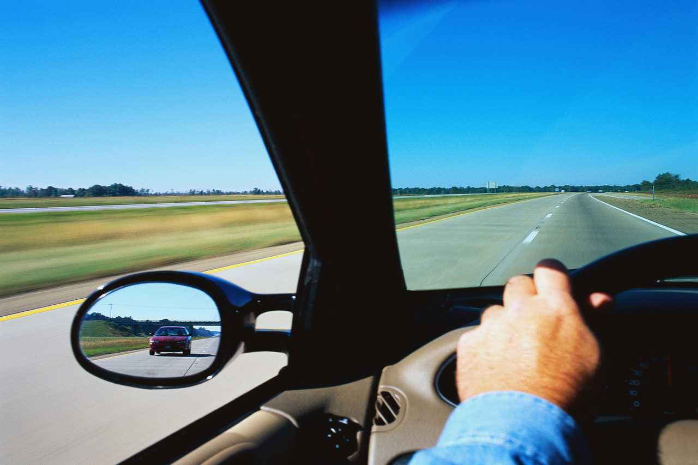
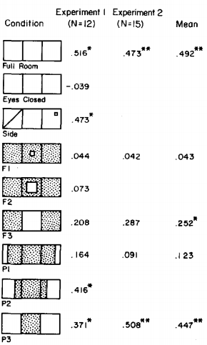
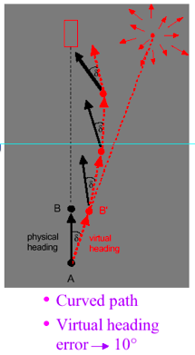
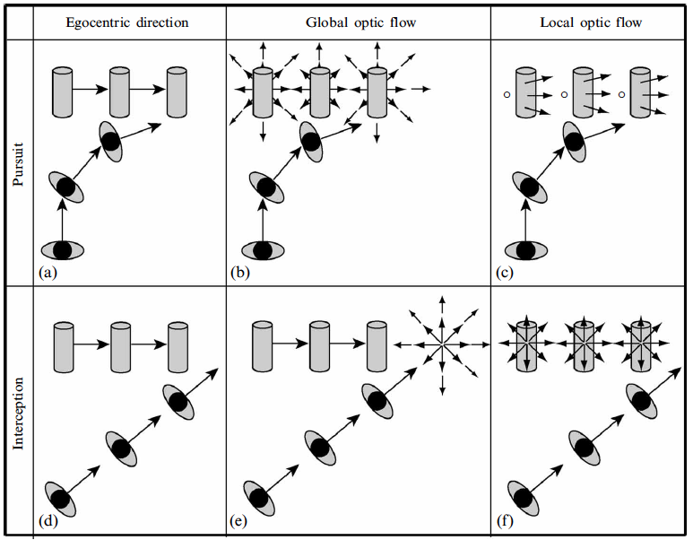

# Presentation: 4-Locomotion1.pptx

## Slide 1

### Locomotion I

Empirical studies of some of Gibson’s rules for locomotion

---

## Slide 2

> **Notes:** Crawling, flying, hopping, walking, running, swimming

The main point is that it’s not all about running.

Visual perception makes locomotion truly useful bc we can orient to distal objects.

First lecture I would devote to the visual control of locomotion with a particular emphasis on Gibson’s rules for locomotion and the current research in this area.

---

## Slide 3

Ecological context – ambient energy arrays (optic array specifically) have structure.

This structure is information and it is available to be detected by any organism that has a perceptual system to do so.

Detection of information occurs directly (i.e., without any need for the internal mediational states).

For example, optic flow fields are directly used for behavioral control without any “high-level processing, storage, or representation.

Major premises of ecological approach to locomotion regulation:

---

## Slide 4

2) To move forward/backward – coordinate your body in such a way so as to produce global infllow/outflow of the optic flow. Inflow is information about forward movement.

3) To move to a target – put focus of expansion (FOE) is on the target. FOE is information about movement to a target.

4) To change direction – change the location of the focus of expansion (FOE) from it’s previous position. FOE change is information about change in movement direction.

5) Approach without collision – keep rate of object expansion steady.

1) To be still – coordinate your body (DOFs) in such a way so as to minimize change in the optic flow. Nonflow is information about being stationary.

Gibson proposed several rules for visual guidance of locomotion:

---

## Slide 5

To be still – coordinate your body (DOFs) in such a way so as to minimize change in the optic flow. Nonflow is information about being stationary.

To move forward/backward – coordinate your body in such a way so as to produce global infllow/outflow of the optic flow. Inflow is information about forward movement.

---

## Slide 6

Lee & Lishman (1974)

Children data:

Sway: 26%

Stagger: 23%

Fall: 33%

No response: 18%

Visual proprioception or visual kinesthesis

Independent variable: room oscillation (forward/backward)

Dependent variable: postural sway

Results:

Ernst Mach

Moving Room Paradigm

> **Notes:** Sensory conflict: mechanical and visual proprioception are discrepant. Typically, vision overrides other sources of information (i.e. haptic).

---

## Slide 7

Radial flow

Lamellar flow

Is there a difference in how radial and lamellar flow affect us?

> **Notes:** With any linear motion, if we look in the direction of motion, optical flow expands radially outward from the point toward which we are moving and sweeps laterally past us, converging behind. If we look at different parts
of this overall flow, we find different local structures. Near the line of motion, the pattern of flow is almost exclusively radial, whereas at those points where the flow sweeps past the observer, the lines of flow have become nearly parallel, much like the lines of longitude on a globe, which converge at the poles but are parallel at the equator

---

## Slide 8

Stoffregen (1985)

What is the effect of central vs. peripheral optic flow on postural control?

Conclusion: Peripheral flow has a stronger influence on perceived egomotion than central flow.

Sample records of room and observer movement. (Scale is the same on both records.)

The diagonal line through the left wall in the side condition indicates that that wall was out of sight behind the observer's head.

The data shown are mean correlations between room movement and observer sway.

The small squares in the schematic layout and in the side condition indicate the area of gaze.

> **Notes:** But full view frontal also influenced sway – frontal of can also influence posture, but less so.

Field of view

Specialization of the retinal surface and perceptual effectiveness of flow.

Unoccupied ambient optic array vs. occupied

Field of view

---

## Slide 9

However, retinal position is not the only factor to affect egomotion

Peripheral retina appears to be specialized for pick up of lamellar optical flow, but not radial flow.

Additional conclusions: retinal location is not the whole story; structure of the ambient optic array also matters (radial vs. lamellar). Retinal specialization and the AOE structure are complimentary.

Stoffregen, T. A. (1985). Flow structure versus retinal location in the optical control of stance. Journal of Experimental Psychology: Human Perception and Performance, 11(5), 554–565. https://doi.org/10.1037/0096-1523.11.5.554

---

## Slide 10

3) To move to a target – put focus of expansion (FOE) is on the target. FOE is information about movement to a target.

---

## Slide 11

FOE specifies direction of egomotion or heading

Question: Can we still perceive heading direction?

Warren (1988)

Effect of eye movement on retinal flow – disrupts the flow pattern

Warren (1988): Can people actually determine the direction of locomotion based on the optic flow patterns?

Retinal flow vs. ambient optic flow

> **Notes:** Brings up the issue of retinal and optical flow.

What is the thinking about this? Now the debate slowed down. Easy to be confused by this. Again, for Gibson AOE is independent of the animal. Retinal flow assumes an animal present.

Describe differences between retinal and ambient optic flow.

Manipulation of retinal flow, if we can still tell the heading direction, then information for heading direction is not in the retinal flow. Need to be careful about the retinal and AOE flows.

It really is an empirical question worth studying.

---

## Slide 12

Result: Heading angle judgments were accurate in both conditions

“Are you going to the left or right of the blue bar?”

Warren (1988)

Chance level

Eye movement fixed

Smooth pursuit eye movement

Independent variable:

Dependent variable:

---

## Slide 13

Warren et al. (2001): Is locomotion controlled using FOE or using a simpler egocentric direction strategy?

Walk in the egocentric direction of the goal

Walk so as to keep the FOE on the goal

“Locomotor axis”

> **Notes:** Locomotor axis – walking observer’s direction of travel specified proprioceptively (Telford, 1995).

---

## Slide 14

VenLab

directed by Bill Warren at Brown University

https://sites.brown.edu/venlab/

---

## Slide 15

Warren et al. (2001)

Virtual heading manipulation: Offset FOE from the direction of walking by δ = 10°

Task: walk to the goal

Dependent measure: Path in the physical world

Additional independent variable: richness of the virtual world

---

## Slide 16

Optic flow strategy

Egocentric strategy

Optic flow strategy predicts linear trajectories in locomotion

Egocentric strategy predicts curved trajectories

Predictions:

Walk toward the target and ignore FOE

Walk so that FOE and the target overlap

> **Notes:** In the critical manipulation, the heading direction specified by optic flow was displaced by an angle of 10 deg from the actual direction of walking.

If subject walks in the egocentric direction, then the FOE would appear on the left from the target, yielding a virtual heading error of 10.

If the subject walked placing the FOE on the goal, the virtual heading error would be 0 and the path would be straight, but the subject would actually walk slightly to the left of the goal.

If the subject walked based on their locomotor axis,

---

## Slide 17

Results mostly favored the optic flow hypothesis but showed that egocentric direction also matters.

Conclusion: locomotion was governed by a combination of the two variables.

When no flow was available, behavior was consistent with the egocentric direction hypothesis, but as flow was added to the display, it increasingly dominated behavior, following the optic flow hypothesis more consistently.

---

## Slide 18

5) Approach without collision – keep the rate of object expansion steady.

---

## Slide 19

Perceiving Collisions & Interceptions With Objects

Information about time-to-contact

Animals can control their approach to objects by using a particular kind of information in the optical array: so-called tau (τ)

---

## Slide 20

A Computational Approach (Indirect Perception)

Since it is true that

d = vt (distance = speed  time),

and by algebra,

d/v = t

an observer can compute time-to-contact by:

(1) Judging the distance between the self and object

(2) Judging speed

(3) Dividing distance by speed

Problem: People are bad at judging absolute distance & speed (pretty much bad at any kind of absolute judgment of this kind)

If humans are horrible at these tasks, how do gannets compute time-to-contact in this way? The gannet somehow knows when to fold its wings back before hitting the water, but how?

---

## Slide 21

Direct Perception Approach

Don’t need to judge distance & time; there is information

available to the visual system that specifies time-to-contact

Has to do with how image size changes with distance

---

## Slide 22

• S = size of closed optical contour (size of image an object forms on the retina)

• As an object gets closer to an observer, S increases

SD

SC

SC > SD

• Time-to-contact does not need to be computed, because an animal can perceive time-to-contact by detecting the optical variable tau

• Tau is information

• R is the rate at which S changes; determined by approach speed

• Time-to-contact is specified by t  (tau), which is inversely

proportional to the rate of expansion of a closed optical contour: t ~ 1/R

- Slow object: R is low, therefore t is high

More time to duck, catch, etc.

- Fast object: R is high, therefore t is low

Less time to duck, catch, etc.

---

## Slide 23

Approach a moving target (pursuit): How do people walk to a moving target, and what visual information do they use to do so?

---

## Slide 24

Fajen & Warren (2004)

β

β – target-heading angle (bearing angle)

Illustration of the two strategies (pursuit and interception) and three sources of information (egocentric direction, global optic flow, and local optic flow) for walking to a moving target.

Results showed that people seem to use this strategy

---

## Slide 25

• Optic flow demonstrates importance of activity for perception—not defined in  absence of observer motion, but  without optic flow the control of motion would be difficult

---

## Slide 26

Overall, Gibson’s 1978 book instigated much research.

There are some changes to thinking, but overall, it seems on a good track.

---

